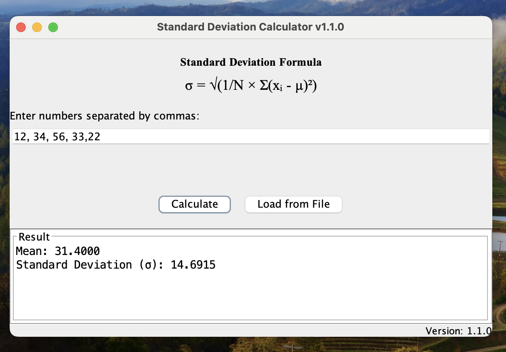

# StandardDeviationCalculator

A user-friendly Java Swing GUI application to compute the mean and standard deviation of a list of numbers.  
Designed with accessibility and user interface design principles in mind.  
**Version: 1.0.1** (Semantic Versioning)

---

## Features

- Enter numbers manually (comma-separated) or load from a `.txt` file
- Calculates and displays both mean and standard deviation (σ)
- Shows the standard deviation formula for user reference
- Clear, helpful error messages for invalid input
- Accessible:  
  - Screen reader support via Java Accessibility API  
  - Tooltips and accessible descriptions on all major controls  
  - Keyboard navigable (Tab support)
- Fully compliant with [Google Java Style Guide](https://google.github.io/styleguide/javaguide.html)
- Designed using established User Interface Design Principles (see [UID Principles](docs/uid_principles.pdf))

---

## Getting Started

### Prerequisites

- Java 8 or higher
- [Maven](https://maven.apache.org/) or `javac` and `java` installed

### Compile and Run

**Option 1: Compile & Run Manually**
```sh
javac concordia/StandardDeviationCalculator.java
java concordia.StandardDeviationCalculator
```

## Usage

* **Manual Input:**
  Enter numbers separated by commas (e.g., `12, 15, 20, 17.5`) and click **Calculate**.
* **File Input:**
  Click **Load from File** and select a `.txt` file containing numbers (comma-separated or one per line).

Results will be displayed instantly in the "Result" section at the bottom.

---

## Screenshots


---

## User Interface & Accessibility

This application follows these principles:

* **Consistency** in design and behavior
* **Immediate feedback** for all actions and errors
* **Proximity/grouping** for related controls
* **Accessibility**:

  * Screen-reader ready (via Java Accessibility API)
  * Descriptive labels and tooltips for all controls
  * Logical tab order and keyboard navigation
  * High contrast and legible fonts

---

## Semantic Versioning

This project uses [Semantic Versioning](https://semver.org/).

* Current version: **1.1.3**
* Update the version in the source code and this README for each release.

---

## Code Style

* All Java code conforms to the [Google Java Style Guide](https://google.github.io/styleguide/javaguide.html)
* Static analysis and code style checks performed with [Checkstyle](https://checkstyle.org/) and [SonarLint](https://www.sonarlint.org/).

---

## License

MIT License

---

## References

* [Google Java Style Guide](https://google.github.io/styleguide/javaguide.html)
* [Java Accessibility Documentation](https://docs.oracle.com/javase/tutorial/uiswing/misc/access.html)
* UID & Accessibility Principles ([uid\_principles.pdf](docs/uid_principles.pdf), [understanding\_accessibility.pdf](docs/understanding_accessibility.pdf))
* [Semantic Versioning](https://semver.org/)

---

## Authors

* \[Akhil Dhiman] — \[[dakhil655@gmail.com](mailto:dakhil655@gmail.com)]

---

## Acknowledgements

* Special thanks to Concordia University and SOEN 6011 resources.
* \[Johnson, 2021], ISO/IEC 25010, ISO 9241-151 (for UID/accessibility guidance)
